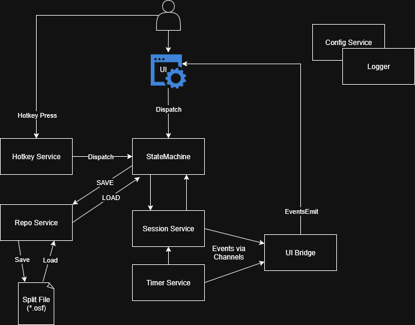

# Architecture

[Common Terms](#common-terms) • [Frontend (React)](#frontend-react) • [Session Service](#session-service) • [Hotkey System](#hotkey-system) • [Timer](#timer)

---

---

## Concepts

### State Machine
- Manages the overall state of the program.  Defined in `statemachine` package, along with specific states
- Exposes the `Dispatch` method receiver which is the primary way the frontend communicates to the backend
  - `Dispatch` takes a `Command` and a `Payload`. `Payload` can be null, and the contents depends on the command and current state

### Session
- Manages:
  - Loaded split file
  - Current segment
  - Timer service
  - Hotkey service
  - Has a sub-state machine that tracks the status of a run (Idle, Running, Paused, Finished)

### DTO/Domain
- Domain models are defined in the `session` package and is what the application works against
- `dto` package is used to define the "on-disk" shape of the domain models with serializable data types
  - `dto` types are used to send data both to the frontend, and to the repository for file storage
- `repo/adapters` is used to translate between domain models and dto models
- `repo` provides the actual reading and writing of bytes to and from `dto` models

### UI Bridge
- `bridge` package listens for updates from the session service and timer service, and communicates them to
the frontend via EventsEmit

## Frontend (React)
- A standard **React + TypeScript** app, styled via CSS skins.
- Communicates with the backend via the `Dispatch` bound method provided by the state machine
- **Event-based communication**
  - Backend emits events via `runtime.EventsEmit`.
  - Frontend subscribes with `EventsOn`, which returns an unsubscribe function.
    - `state:enter` sent by the statemachine to inform App.tsx of state changes along with any data needed by the frontend for that state
    - `session:update` sent by the session service to inform the frontend of relevant run and state data.
      - notably it's sent when the user finishes a segment and executes Split() to inform the split list that a segment is complete
    - `timer:update` sent by the timer service to provide multiple frontend components with the current run time 

## Data Management and Models
### Split File (`*.osf`)
- The **main data store** for a run.
- JSON format, versioned for stability.
- Contains:
  - Game name
  - Category
  - Attempt count
  - List of segments
  - Segment statistics (PB, golds, averages, sum-of-bests)
  - Collection of runs

### Segment
- A single part of a run (e.g. `"Level 1"`).
- Contains:
  - Unique ID
  - Name
  - Best time (gold)
  - Average time

### Split
- Information about a completed Segment
- Contains:
  - Unique ID
  - Time specified segment was completed in
  - Cumulative time for run at time of split

### Run
- Collection of splits
---

## State Management
- Use React state only for **UI rendering**.
- Application state (timer, segments, attempts) lives in Go.
- Subscribe to state changes via events.

---

## Session Service
- Responsibilities:
  - Start/pause/reset/split timer
  - Emit events to bridge for delivery to frontend (timer ticks, splits, file changes)

---

## Hotkey System

- **Hotkey Service**:
  - Receives keypresses from an OS-specific provider.
  - Maps hotkeys to `statemachine.Dispatch` actions (e.g., `Space` → `SPLIT`).

- **Providers**:
  - OS-specific implementations (Windows, Linux, macOS).
  - Use build tags to compile only for supported platforms.
  - Example: Windows uses a low-level keyboard hook (`user32.dll`).

---

## Timer

- A **monotonic stopwatch** implemented in Go.
- Uses a ticker to calculate `time.Duration` since `startTime`.
- Precision: centiseconds.
- Publishes tick events for live updates.
